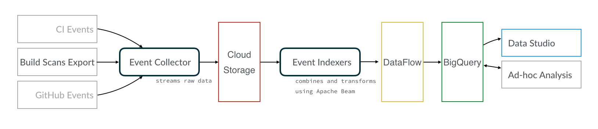

= Gradle Build Analysis Project

The purpose of this project is to provide data for developer productivity by collecting and reporting:

 * What are the costliest tasks (time x frequency) of local developers, by project?
 ** What is the breakdown of these tasks in terms of cache effectiveness, network, something else?
 ** Given a task, tell me the cache rate, mean/stddev/histogram, inputs, network, etc. How has this changed over time?
 * What are the costliest errors (again, time x frequency) and build failures, segmented by environment and failure type?
 ** What is the impact of flaky test failures on local builds?
 * What versions of Gradle BT are in use at Gradle, and with what frequency? Similarly, what versions of guava are in use at Gradle across among active projects?

These applications collect and index Gradle Enterprise and GitHub events data into Google Cloud Storage and BigQuery.

== Data Pipeline



=== Build Event Collector app
This application is responsible for streaming build event data from a configured Gradle Enterprise export API endpoint into a specified Google Cloud Storage bucket.
It pulls all builds down and all configured event types, avoiding as much data interaction (parsing, filtering) as possible.

Reference Materials:

 * link:https://docs.gradle.com/enterprise/export-api/[Gradle Enterprise Export API Manual]
 * link:https://cloud.google.com/storage/docs/uploading-objects#storage-upload-object-java[Google Cloud Storage docs]

==== Running Build Event Collector

```
gcloud compute instances create build-event-collectorator1 \
   --preemptible \
   --image-family debian-9 \
   --image-project debian-cloud \
   --machine-type n1-highmem-8 \
   --scopes "userinfo-email,cloud-platform" \
   --metadata startup-script='#!/bin/sh
APP_NAME="build-event-collectorator"
APP_VERSION="0.5.0"
export GRADLE_ENTERPRISE_HOSTNAME="gradle-enterprise.mycompany.com"
export GRADLE_ENTERPRISE_USERNAME="my-username"
export GRADLE_ENTERPRISE_PASSWORD="my-password"
export GCS_RAW_BUCKET_NAME="build-events-raw"
gsutil cp "gs://gradle-build-analysis-apps/maven2/org/gradle/buildeng/analysis/${APP_NAME}/${APP_VERSION}/${APP_NAME}-${APP_VERSION}.zip" .
apt-get update && apt-get -y --force-yes install openjdk-8-jdk unzip
update-alternatives --set java /usr/lib/jvm/java-8-openjdk-amd64/jre/bin/java
echo "Running ${APP_NAME}-${APP_VERSION}..."
unzip "${APP_NAME}-${APP_VERSION}.zip"
sh "${APP_NAME}-${APP_VERSION}/bin/${APP_NAME}"
echo "Application exited"'
```

By default the collector processes only builds from the moment the app is started, but you can collect past builds by setting `export BACKFILL_DAYS=<number>` in the startup script.

Similarly, you can specify a `export LAST_BUILD_ID="jh4qknspatp2y"` to start streaming from the build _immediately after_ the given build ID.

==== Getting logs for a given instance

```
gcloud compute instances get-serial-port-output build-event-collectorator1
```

=== Build Producerator app
This app is not necessary right now. It streamed build events to Google Cloud PubSub to allow fanout with many build event collectors.

Currently the limiting factor is network outbound from the Gradle Enterprise server and multiple downloaders do not make processing faster.

=== Build Event Indexer apps
These applications are responsible for transforming raw data pulled from Google Cloud Storage, tranforming and combining those events using link:https://beam.apache.org/[Apache Beam].
Each application consists of a `EventModel` that represents the schema of the BigQuery table to be generated, an `EventJsonTransformer` which filters and transforms data, and a `BuildIndexer` which writes to BigQuery.

You can develop your own indexer by creating a Model, EventsJsonTransformer, and an Indexer.
You will find several indexers for inspiration under `build-event-indexerator/src/main/kotlin`.

[NOTE]
====
We are using `FileIO` in Apache Beam here to read whole files and filter lines rather than reading using `TextIO` because doing so encounters an Exception:
       "Total size of the BoundedSource objects generated by split() operation is larger than the allowable limit."
       See link:https://cloud.google.com/dataflow/docs/guides/troubleshooting-your-pipeline#total_number_of_boundedsource_objects_generated_by_splitintobundles_operation_is_larger_than_the_allowable_limit_or_total_size_of_the_boundedsource_objects_generated_by_splitintobundles_operation_is_larger_than_the_allowable_limit[more information].
====

You can run any indexer locally using a task rule and the `DirectRunner`:

```
./gradlew :build-event-indexerator:indexBuildEvents --args="--runner=DirectRunner --project=build-analysis --input=gs://build-events-raw/2019/01/01/22*.txt --output=build-analysis:gradle_builds.builds"
```

Once you're happy with your Apache Beam setup, create a Google Dataflow job to run over a larger input.

```
./gradlew :build-event-indexerator:indexTestEvents --args="--runner=DataflowRunner --project=build-analysis --input=gs://build-events-raw/2019/01/** --output=build-analysis:gradle_builds.test_executions --region=us-central1 --tempLocation=gs://gradle-dataflow-tmp/$(openssl rand -hex 8)"
```

Let's break this down a bit:

 - `--runner=DataflowRunner` tells Apache Beam that you want to use link:https://console.cloud.google.com/dataflow?project=build-analysis[Google Dataflow] which uses Google Compute Engine under the hood.
 - `--project=build-analysis` configures the Google Cloud project name. We use `build-analysis`.
 - `--input=gs://build-events-raw/2019/01/**` will consume all files from the given link:https://console.cloud.google.com/storage/browser?project=build-analysis[Google Cloud Storage] bucket in the month of January 2019. These build files are keyed by build start time.
 - `--output=build-analysis:gradle_builds.my_builds_table` is the BigQuery table that will be created (if necessary) or appended to.
 - `--region=us-central1` Google Compute region to use for workers. Quotas are set by region, and we have requested increased capacity so that Dataflow can process TBs of build data before Eric dies of old age. This is optional and us-central1 is the default.
 - `--tempLocation=gs://gradle-dataflow-tmp/$(openssl rand -hex 8)` an existing GCS bucket and a random key that Dataflow jobs can use to store temporary files.

=== Creating Dashboards Using Data Studio
Reporting-specific tables must be created in BigQuery in order to keep reasonable Data Studio costs and performance.

You need to use the link:https://cloud.google.com/bigquery/docs/bq-command-line-tool[BigQuery CLI] or API link:https://cloud.google.com/bigquery/docs/creating-column-partitions#creating_a_partitioned_table_from_a_query_result[to create new partitioned tables].
Using time partitioned tables allows us Data Studio to avoid querying all of the data when querying a subset of the time range.

You can generate tables for various dashboards using the following queries:

==== Builds Dashboard

```sql
bq query --location="US" --destination_table="build-analysis:reports.builds_dashboard" --time_partitioning_field="date" --use_legacy_sql="false" --replace --batch '
SELECT
  DATE(buildTimestamp) AS date,
  rootProjectName AS project,
  buildId,
  STARTS_WITH(buildAgentId, "tcagent") AS ci,
  SUM(wallClockDuration) AS total_build_time
FROM
  `gradle_builds.builds`
WHERE
  rootProjectName IN ("gradle",
    "dotcom",
    "dotcom-docs",
    "gradle-kotlin-dsl",
    "ci-health",
    "build-analysis",
    "gradle-profiler",
    "gradle-site-plugin",
    "gradlehub")
  AND buildTimestamp > "2019-01-01"
GROUP BY
  1,
  2,
  3,
  4;'
```

==== Failures Dashboard

```sql
bq query --location="US" --destination_table="build-analysis:reports.failures_dashboard" --time_partitioning_field="timestamp" --use_legacy_sql="false" --replace --batch '
SELECT
  buildId,
  rootProjectName AS project,
  buildTimestamp AS timestamp,
  wallClockDuration AS build_duration,
  STARTS_WITH(buildAgentId, "tcagent") AS ci,
  failureData.category AS failure_category,
  failed_task,
  JSON_EXTRACT(env.value,
    "$.name") AS os
FROM
  `gradle_builds.builds` builds,
  UNNEST(failureData.taskPaths) AS failed_task
CROSS JOIN
  UNNEST(environmentParameters) AS env
WHERE
  rootProjectName IN ("gradle",
    "dotcom",
    "dotcom-docs",
    "gradle-kotlin-dsl",
    "ci-health",
    "build-analysis",
    "gradle-profiler",
    "gradle-site-plugin",
    "gradlehub")
  AND buildTimestamp > "2019-01-01"
  AND BYTE_LENGTH(failureId) > 0
  AND env.key = "Os"'
```

==== Tasks and Build Cache Dashboard

```sql
bq query --location="US" --destination_table="build-analysis:reports.tasks_dashboard" --time_partitioning_field="date" --use_legacy_sql="false" --replace --batch '
SELECT
  DATE(buildTimestamp) AS date,
  rootProjectName AS project,
  CONCAT(tasks.buildPath, " > ", tasks.path) AS absolute_task_path,
  tasks.className AS task_type,
  tasks.outcome,
  tasks.cacheable,
  CASE
    WHEN tasks.cacheable IS FALSE THEN "NOT_CACHEABLE"
    WHEN tasks.cacheable IS TRUE
  AND tasks.outcome IN ("from_cache") THEN "CACHE_HIT"
    WHEN tasks.cacheable IS TRUE AND tasks.outcome IN ("success", "failed") THEN "CACHE_MISS"
    WHEN tasks.cacheable IS TRUE
  AND tasks.outcome IN ("up_to_date",
    "skipped",
    "no_source") THEN "UP_TO_DATE"
    ELSE "UNKNOWN"
  END AS cache_use,
  STARTS_WITH(buildAgentId, "tcagent") AS ci,
  SUM(tasks.wallClockDuration) AS total_time_ms,
  AVG(tasks.wallClockDuration) AS avg_duration,
  STDDEV(tasks.wallClockDuration) AS stddev_duration
FROM
  `gradle_builds.task_executions`,
  UNNEST(tasks) AS tasks
WHERE
  rootProjectName IN ("gradle",
    "dotcom",
    "dotcom-docs",
    "gradle-kotlin-dsl",
    "ci-health",
    "build-analysis",
    "gradle-profiler",
    "gradle-site-plugin",
    "gradlehub")
  AND buildTimestamp > "2019-01-01"
GROUP BY
  1,
  2,
  3,
  4,
  5,
  6,
  7,
  8;'
```

==== Tests Dashboard

```sql
bq query --location="US" --destination_table="build-analysis:reports.tests_dashboard" --time_partitioning_field="date" --use_legacy_sql="false" --replace --batch '
SELECT
  DATE(buildTimestamp) AS date,
  rootProjectName as project,
  CONCAT(t.className, ".", t.name) AS test_name,
  t.taskId as task_path,
  exec.failed AS failed,
  STARTS_WITH(buildAgentId, "tcagent") AS ci,
  SUM(exec.wallClockDuration) AS total_time_ms,
  AVG(exec.wallClockDuration) AS avg_duration,
  STDDEV(exec.wallClockDuration) stddev_duration
FROM
  `gradle_builds.test_executions`,
  UNNEST(tests) AS t,
  UNNEST(t.executions) AS exec
WHERE
  rootProjectName IN ("gradle",
    "dotcom",
    "dotcom-docs",
    "gradle-kotlin-dsl",
    "ci-health",
    "build-analysis",
    "gradle-profiler",
    "gradle-site-plugin",
    "gradlehub")
  AND buildTimestamp > "2019-01-01"
  AND t.suite = FALSE
GROUP BY
  1,
  2,
  3,
  4,
  5,
  6;'
```

==== Dependency Search

```sql
bq query --location="US" --destination_table="build-analysis:reports.dependencies_dashboard" --use_legacy_sql="false" --replace --batch '
SELECT
  DISTINCT(CONCAT(md.group, ":", md.module)) AS group_and_module,
  rootProjectName AS project_name,
  md.version,
  COUNT(buildId) build_count
FROM
  `gradle_builds.dependencies` AS d,
  UNNEST(moduleDependencies) AS md
WHERE
  rootProjectName IN ("gradle",
    "dotcom",
    "dotcom-docs",
    "gradle-kotlin-dsl",
    "ci-health",
    "build-analysis",
    "gradle-profiler",
    "gradle-site-plugin",
    "gradlehub")
  AND buildTimestamp > "2019-01-01"
GROUP BY
  1,
  2,
  3;'
```

=== Ad-hoc Queries
You can query build data using:

 * Google Cloud Project: `your-google-cloud-project`
 * BigQuery Dataset: `gradle_builds`

Here are many of the BigQuery tables generated. All of them that have a timestamp field are partitioned by that field:

 * `builds`
 * `build_cache_interactions`
 * `build_failures`
 * `dependency_resolutions`
 * `exceptions`
 * `network_activity`
 * `task_executions`
 * `test_executions`

Schemas are generated from data classes under `build-event-indexerator/src/main/kotlin/org/gradle/buildeng/analysis/model/` using `BigQueryTableSchemaGenerator`.

Some fields are JSON. See link:https://cloud.google.com/bigquery/docs/reference/standard-sql/json_functions[BigQuery JSON functions] for reference.

=== Updating data
You can use Google Cloud Scheduler or plain old `cron` to schedule ~daily data updates. See link:https://cloud.google.com/scheduler/docs/scheduling-instances-with-cloud-scheduler[Cloud Scheduler Docs]

==== Ad-hoc Query Examples

.Number of build failures
```sql
SELECT
  FORMAT_TIMESTAMP('%Y-%m-%d', buildTimestamp) AS day,
  STARTS_WITH(buildAgentId, 'tcagent') AS isCI,
  COUNT(buildId) AS count
FROM
  `gradle_builds.builds`
WHERE
  buildTimestamp > TIMESTAMP_SUB(CURRENT_TIMESTAMP(), INTERVAL 7 DAY)
  AND BYTE_LENGTH(failureId) > 0
GROUP BY 1, 2
ORDER BY 1, 2;
```

.What versions of Gradle are in use recently?
```sql
SELECT
  buildToolVersion,
  COUNT(buildId) as count
FROM
  `gradle_builds.builds`
WHERE
  rootProjectName = 'gradle'
  and buildTimestamp > TIMESTAMP_SUB(CURRENT_TIMESTAMP(), INTERVAL 7 DAY)
GROUP BY
  1
ORDER BY
  2 DESC;
```

.Is any local build still using Java 7? Using Windows? How much memory/CPUs?
```sql
SELECT
  JSON_EXTRACT(env.value,
    '$.version') as jdk_version,
  COUNT(env.value) as count
FROM
  `gradle_builds.builds`,
  UNNEST(environmentParameters) AS env
WHERE
  buildAgentId NOT LIKE 'tcagent%'
  AND rootProjectName = 'gradle'
  AND env.key LIKE 'Jvm'
  AND buildTimestamp > TIMESTAMP_SUB(CURRENT_TIMESTAMP(), INTERVAL 7 DAY)
GROUP BY
  1
ORDER BY
  2 DESC;
```

.Which Gradle features are everyone using? Is everyone using the Daemon?
```sql
SELECT
  buildAgentId,
  JSON_EXTRACT(env.value,
    '$.daemon') AS daemon,
  JSON_EXTRACT(env.value,
    '$.taskOutputCache') AS build_cache,
  COUNT(env.value) AS count
FROM
  `gradle_builds.builds`,
  UNNEST(environmentParameters) AS env
WHERE
  buildAgentId NOT LIKE 'tcagent%'
  AND env.key LIKE 'BuildModes'
  and (JSON_EXTRACT(env.value,
    '$.daemon') = 'false' OR JSON_EXTRACT(env.value,
    '$.taskOutputCache') = 'false')
  AND buildTimestamp > TIMESTAMP_SUB(CURRENT_TIMESTAMP(), INTERVAL 30 DAY)
GROUP BY 1, 2, 3
ORDER BY 4 DESC;
```

* Given a task, tell me the cache rate, mean/stddev/histogram, etc. How has this changed over time?
* Given a test, tell me the outcome history, duration, flakiness, etc.
* What are the costliest tests? Are there Test tasks that never fail? Could we run them less frequently?
* What are the costliest errors (again, time x frequency) and build failures, segmented by environment and failure type?

== Development

=== Prerequisites

 * Gradle Enterprise Export API access
 * Google Cloud project access
 * JDK 8 installed

=== Google Cloud initial setup

```
gcloud config set compute/region us-central1
gcloud config set compute/zone us-central1-f
```

=== Publishing to Google Cloud

_NOTE: Make sure you're using JDK8 and logged into Google Cloud first._

```
./gradlew publish
```

This will publish distZips for all apps to a Maven repository at `gcs://gradle-build-analysis-apps/maven2`
